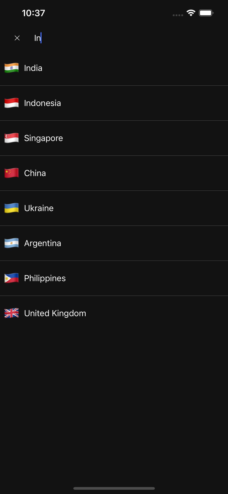
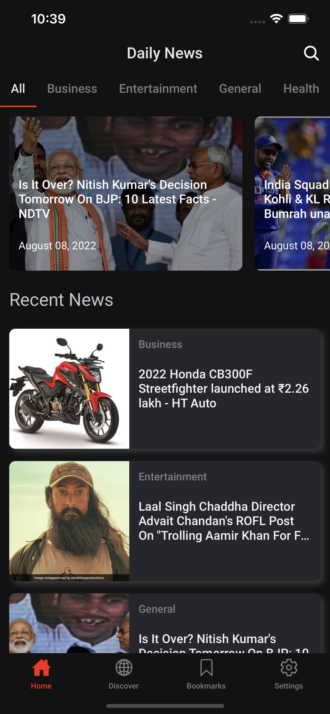

# daily-news

News application using React Native and News API in Express JS. Made with bare workflow and fully compatible on Android and iOS. Get daily highlights or search through upto 7 different categories of news and top sources avaiable for top countries in the world.

## See also

-   Server code: https://github.com/Death14Stroke/daily-news-server
-   UX inspired: https://www.behance.net/gallery/102996435/News-App-Design?tracking_source=search_projects_recommended%7Cnews%20app%20mobile

## Build Android apk

```
npx mkdirp android/app/src/main/assets/ && react-native bundle --platform android --dev false --entry-file index.js --bundle-output android/app/src/main/assets/index.android.bundle --assets-dest android/app/src/main/res/
```

Alternatively, [download]("/outputs/daily-news-release.apk") the apk.

## Outputs

|                                                                                             |                                                                                                             |     |
| :-----------------------------------------------------------------------------------------: | :---------------------------------------------------------------------------------------------------------: | :-: |
|     <br>View top headlines easily      |   <br>Discover sources for various kinds of news   |
| <br>Search news by keywords |     <br>Bookmarks news to read later offline      |
|         <br> Read details         |        <br>Customize look and feel         |
|   <br>Select your country    |  <br> Catch up highlights of the day before bed   |
|  <br>Dark mode for reading   |            <br>View sources in-app             |
|  <br>Attractive splash screen  | <br>Modern skeleton loader for both themes |
